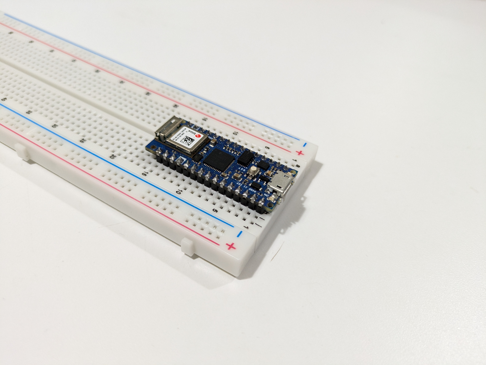
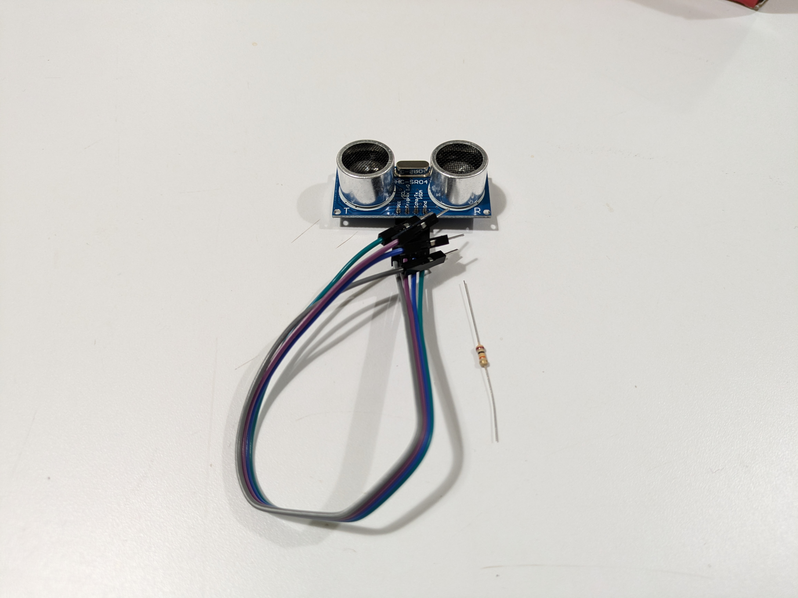
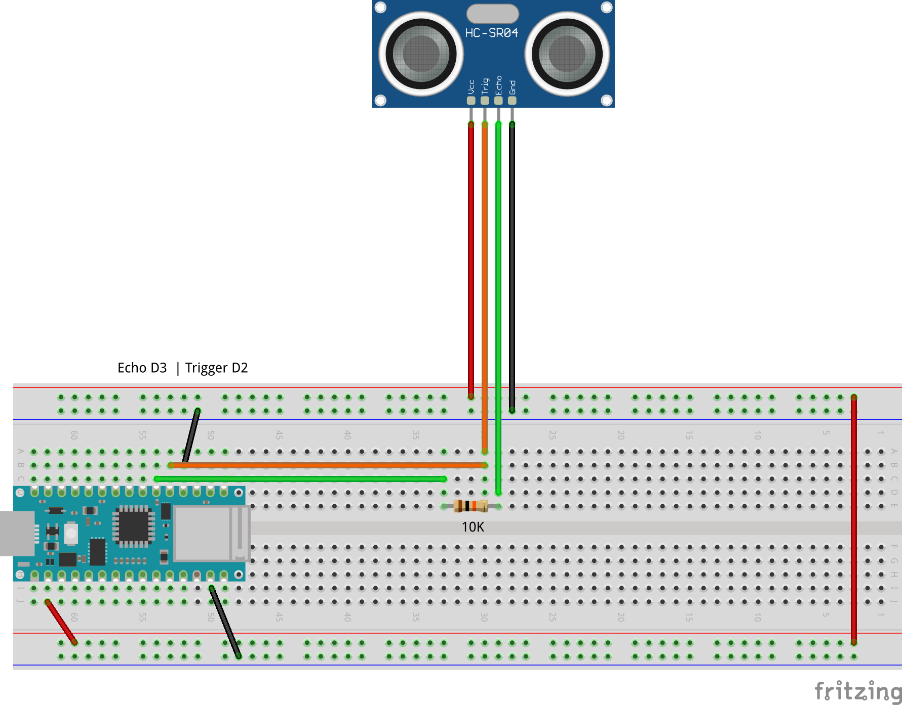
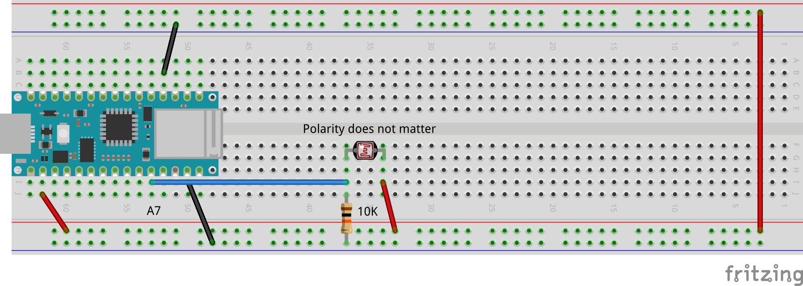
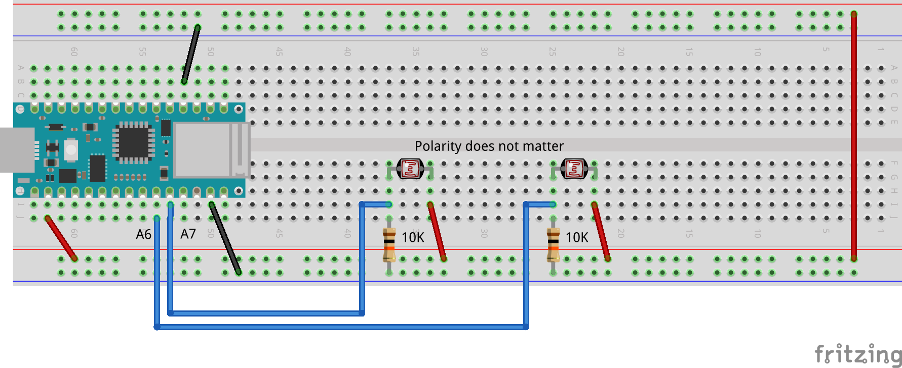
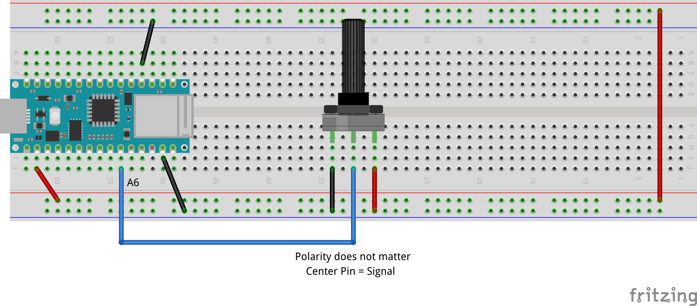
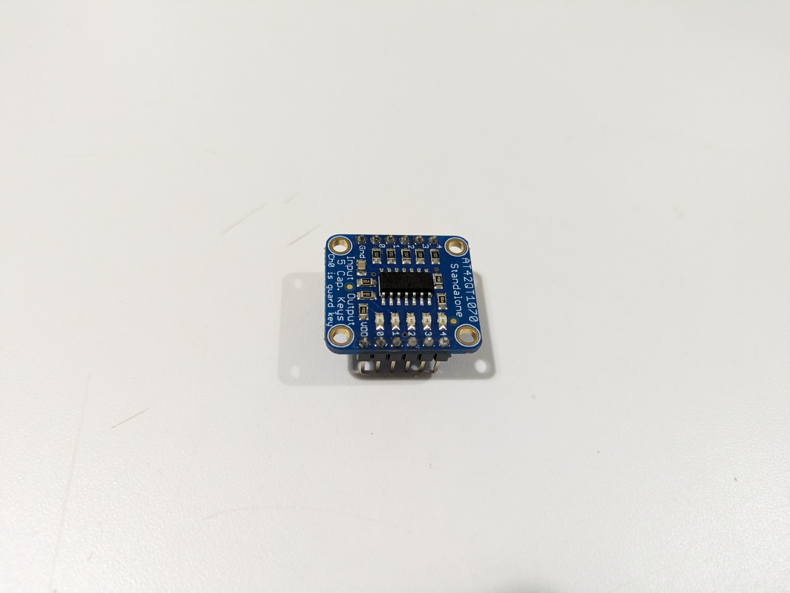
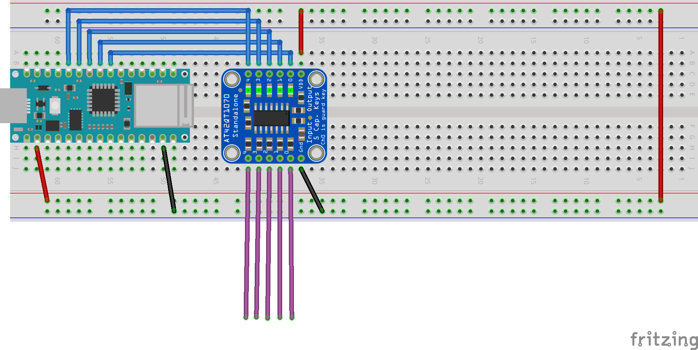
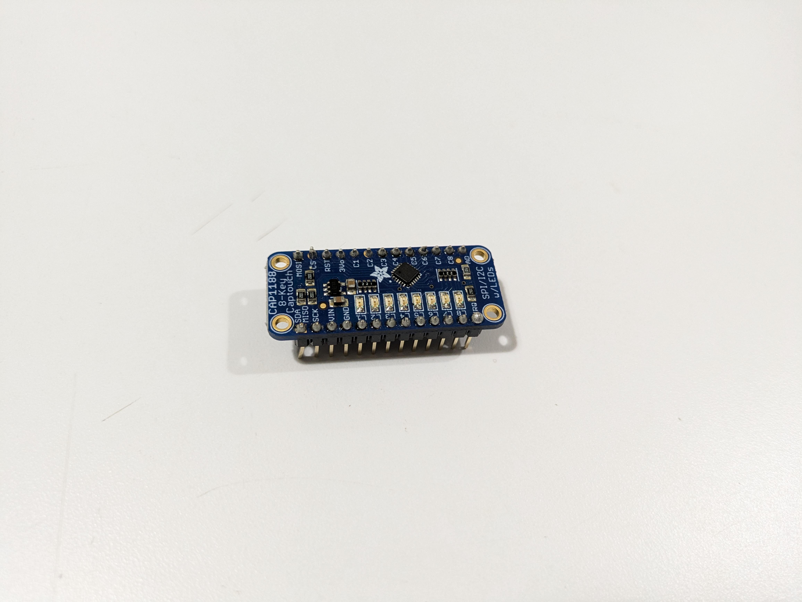
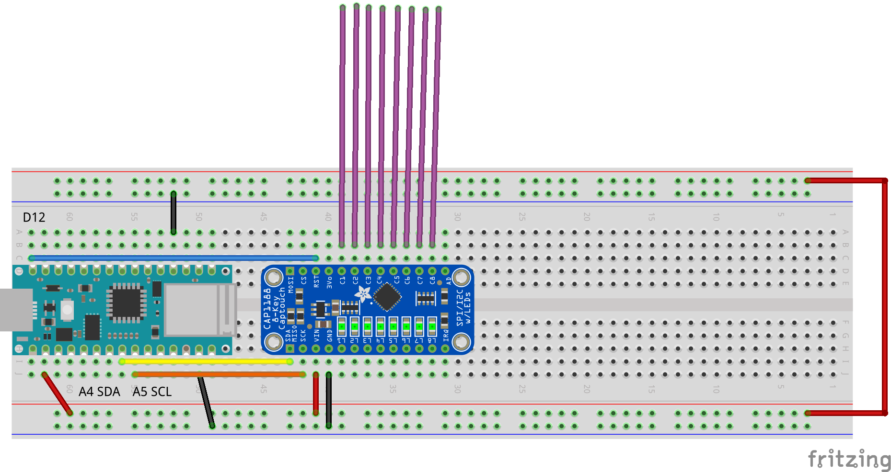

# Arduino Sensors Guide

## Table of Contents
- [6 DOF IMU](#6-dof-imu)
- [Distance Sensor](#distance-sensor)
- [Light Sensor](#light-sensor)
- [Potentiometer](#potentiometer)
- [Capacitive Touch 5](#capacitive-touch-5)
- [Capacitive Touch 8](#capacitive-touch-8)

## 6 DOF IMU

Onboard sensors included in the Nano33 IOT. 3 axis accelerometer, 3 axis gyroscope.

### Details
- **Data Generated**: Raw acceleration data, both rotational and inertial. Because it is only a 6axis IMU the position of the sensor at startup/calibration is the 0 point. Orientation in degrees can be calculated by using other libraries
- **Libraries Needed**: 
  - Arduino_LSM6DS3
  - SensorFusion
- **Components Needed**: None

### Examples
1. [Basic Acceleration](Sensors/IMU/imu_accelerationData/imu_accelerationData.ino)
   - Calculates the acceleration in each axis as well as the overall movement level.

2. [Orientation Data](Sensors/IMU/imu_orientationData/imu_orientationData.ino)
   - Uses SensorFusion to calculate Roll/Pitch/Yaw in Degrees

## Distance Sensor

Uses an ultrasonic speaker and microphone to measure the distance to the closest object.

### Details
- **Data Generated**: Returns the value in Centimeters. Data is affected by the shape and material of the object
- **Libraries Needed**: HCSR04
- **Components Needed**: 10K Resistor, Jumper Wires

### Examples
1. [Raw and Smoothed Distance](Sensors/Distance/distance_raw_smoothed/distance_raw_smoothed.ino)
   - Calculates both the basic distance value and a smoothed value using a rolling average

2. [Motion Detection](Sensors/Distance/distance_motionDetection/distance_motionDetection.ino)
   - Calculates the total motion and 1D direction: Toward / Away

### Wiring Diagram

## Light Sensor

Also called a Light Dependent Resistor (LDR) or a photocell, it changes its resistance value based on the amount of light hitting the surface.

### Details
- **Data Generated**: 0-1023 Read via an Analog Input
- **Libraries Needed**: None
- **Components Needed**: 10K Resistor

### Examples
1. [Basic Light Reading](Sensors/Light/ligh_raw_smoothed/ligh_raw_smoothed.ino)
   - Reads the immediate value as well as a smoothed value calculated with a rolling average
   - Compares the current value to the calibrated value read at startup

2. [Compare Sensors](Sensors/Light/light_compareSensors/light_compareSensors.ino)
   - Reads and compares values from two light sensors
   - Determines which Sensor is Darker

### Wiring Diagrams
Single Sensor:

Dual Sensors:

## Potentiometer

A variable resistor that changes value based on the position of the knob.

### Details
- **Data Generated**: 0-1023 Read via an Analog Input
- **Libraries Needed**: None
- **Components Needed**: None

### Examples
1. [Basic Reading](Sensors/Potentiometer/potentio_smoothed/potentio_smoothed.ino)
   - Reads the immediate value as well as a smoothed value calculated with a rolling average

2. [Direction and Velocity](Sensors/Potentiometer/potentio_direction_velocity/potentio_direction_velocity.ino)
   - Calculates the velocity and direction of the turning motion

### Wiring Diagram

## Capacitive Touch 5

Converts Capacitive touch input to digital values. Can only read 1 input at a time.

### Details
- **Data Generated**: Digital signals that can be read by any digital pin
- **Libraries Needed**: None
- **Components Needed**: None

### Examples
1. [Basic Touch Reading](Sensors/Capacitive/touch5/touch5.ino)
   - Reads and touch inputs

2. [Touch Timing](Sensors/Capacitive/touch5_tapTime_tapSpeed/touch5_tapTime_tapSpeed.ino)
   - Calculates the speed of touch/release on Input 1

### Wiring Diagram

## Capacitive Touch 8

Reads up to 8 capacitive touch inputs and transmits data over I2C. Can read multiple touches simultaneously.

### Details
- **Data Generated**: Bit Mask of all touches, Must be unpacked to individual values
- **Libraries Needed**: Adafruit Cap 1188
- **Components Needed**: None

### Examples
1. [Basic Reading](Sensors/Capacitive/touch8/touch8.ino)
   - Reads and unpacks all 8 values

2. [Compare Touch Speed](Sensors/Capacitive/touch8_tapSpeedComparison/touch8_tapSpeedComparison.ino)
   - Reads Touch data on inputs 0,1
   - Calculates the touch/release speed for both and compares them

### Wiring Diagram

